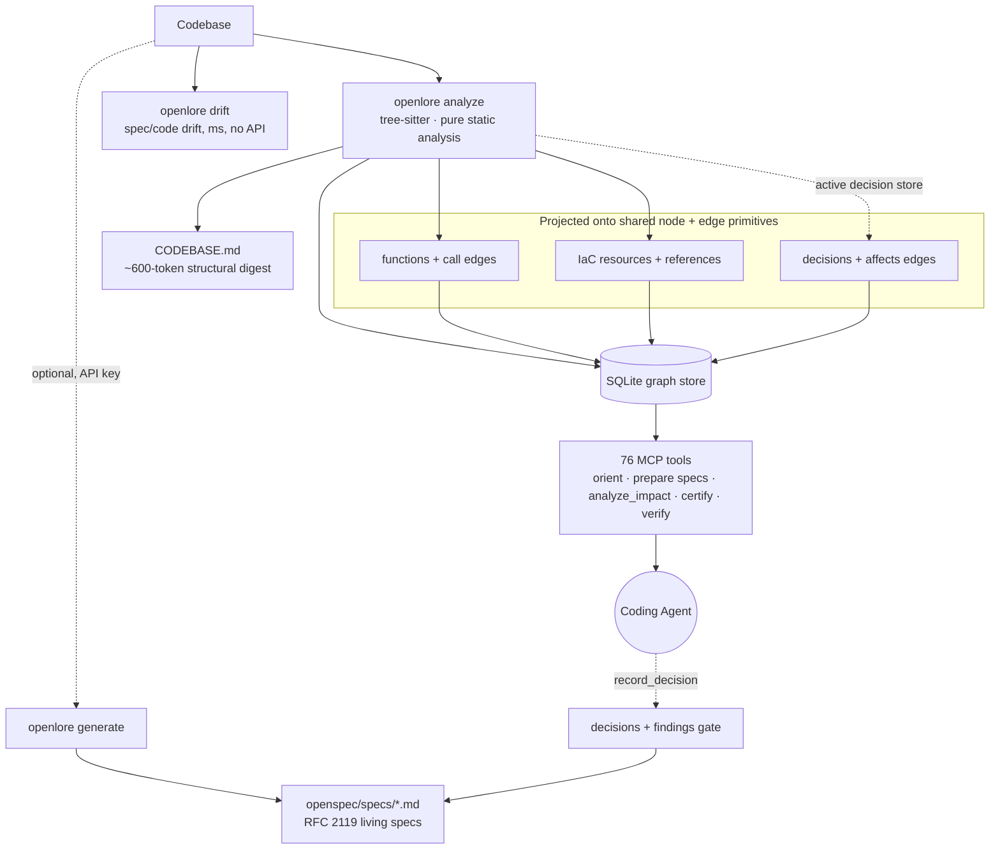

<h1 align="center">OpenLore</h1>

<p align="center">
  <strong>Deterministic, local-first memory and guardrails for AI coding agents — with no LLM in the hot path.</strong><br>
  One call tells your agent the code a task touches; one gate tells it what's unsafe to change.<br>
  Grounded in static analysis. No API key. Same answer every time.
</p>

<p align="center">
  <a href="https://www.npmjs.com/package/openlore"></a>
  <a href="https://github.com/clay-good/OpenLore/actions/workflows/ci.yml"></a>
  <a href="LICENSE"></a>
  =22.19">
  <br>
  
  
  
  
  <a href="https://github.com/clay-good/OpenLore/stargazers"></a>
</p>

<p align="center">
  
</p>

<p align="center"><em>A real, unedited recording — the published <code>openlore</code> on a fresh clone of <a href="https://github.com/BurntSushi/ripgrep">ripgrep</a>. <strong>install</strong> wires your agent and indexes the repo live — 235 files, 2,978 functions, 4,329 call edges in <strong>14 seconds</strong>, no API key → <strong>orient</strong> returns the code a task touches → <strong>review</strong> catches a signature change that left <strong>39 callers</strong> stale → <strong>prove</strong> projects the payoff. Re-record it yourself: <a href="docs/openlore-demo.tape"><code>docs/openlore-demo.tape</code></a>.</em></p>

<p align="center">
  <strong><a href="#install-in-one-command">Install</a> · <a href="#what-you-get">What you get</a> · <a href="#value-scorecard--does-it-pay-for-itself">Benchmarks</a> · <a href="#governance">Governance</a> · <a href="#how-it-works">How it works</a> · <a href="#openlore-vs-alternatives">vs. Alternatives</a> · <a href="#documentation">Docs</a></strong>
</p>

---

AI coding agents are powerful but **amnesiac and ungoverned**: every task restarts by re-reading the same files, long sessions drift onto stale assumptions, and nothing warns the agent when a change is about to break a contract or cross a boundary.

OpenLore fixes both halves. It runs a **one-time static analysis** of your repo and keeps a live knowledge graph — call structure, types, tests, decisions, IaC, spec drift. Your agent queries it to **start every task already oriented** and to **certify a change before it lands**. It's **deterministic and local-first** — no LLM in the hot path — so the same question always returns the same grounded answer, and the agent is *told when a fact goes stale* instead of served a confident guess.

## Install in one command

```bash
npm install -g openlore && openlore install
```

That one command **auto-detects your agent** (Claude Code, Cursor, Cline, Continue, Pi, AGENTS.md), **wires it to call `orient()` automatically**, **registers the MCP server**, and **builds the index** — no API key, no config, no questions. Then ask your agent:

> **`orient("add a payment method")`**

…and it begins already knowing the relevant functions, their callers, matching specs, tests, and the risk of changing each — in a single call.

> **Zero config, everything discoverable.** Core value needs no keys. Run **`openlore features`** to see every opt-in capability (embeddings, the commit gate, the spec store…), whether it's active, and the one command to turn it on.

---

## What you get

Two things, both deterministic and local — OpenLore **remembers** your architecture so every task starts oriented, and **governs** what the agent changes before it lands.

**🧠 Memory — start every task already oriented**

- **Orient in one call** — `orient(task)` returns the relevant functions, their callers, matching specs, tests, and insertion points in a single call (**~430µs p50** on a 15k-node graph) — instead of a dozen exploratory file reads.
- **Survives refactors** — anchored notes and decisions carry forward when a symbol is renamed or moved, instead of orphaning.
- **One graph for everything** — application code, **Infrastructure-as-Code**, and **architectural decisions** live on the same graph, so one query spans all three.
- **Told when a fact is stale** — the agent is warned when a cached fact has aged or the repo moved, instead of building on a confident guess.

**🛡️ Governance — guardrails on what the agent changes**

- **Breaking-change verdict** — `certify_public_surface` classifies every changed export `breaking / non-breaking / potentially-breaking` and **names the consumers each break hits**. Conservative — never silently "safe."
- **Sensitive-boundary check** — `change_impact_certificate` flags when a diff **opens a new path into a boundary you declared** (reachable after the change, not before).
- **Grounded claims** — `verify_claim` returns `confirmed / refuted / unverifiable` with a citation, before an agent asserts "X is dead" or "Y is safe to change."
- **One commit gate** — `openlore enforce` blocks on findings you mark `blocking`, new debt under `frozen`, or an unverifiable frozen baseline. Advisory by default, no API key.

Full guardrail table with commands: [Governance](#governance).

**📊 Honest by construction** — **−26% agent round-trips** on deep traces in large repos, with the losses published next to the wins. Every public claim traces to a command you can run.

---

## See it in action

**The same task, twice.** Ask an agent to add a flag to a command it has never seen:

| | Without OpenLore | With OpenLore |
|---|---|---|
| **Opening move** | grep a guessed name → open a file → wrong layer → open three more | `orient("add a --since flag to the blast-radius command")` |
| **What it learns** | file contents, one at a time, in whatever order it guessed | the functions, their callers, the matching specs, and the ranked insertion points — in one call |
| **What it misses** | the five callers living in files it never opened | every caller the graph can see |
| **Before it commits** | "looks right to me" | `blast_radius` → tests to run; `certify_public_surface` → the consumers this change breaks, by name |

The measured effect on deep, multi-hop tasks: **25 → 16 round-trips** on excalidraw, **−26%** aggregate. Not magic — the difference between *rediscovering* structure per task and *querying* it. Full numbers, including where it **doesn't** pay off: [Does it pay for itself?](#value-scorecard--does-it-pay-for-itself)

<details>
<summary><strong>See a real <code>orient()</code> result</strong> — one query replaces most exploratory file reads</summary>

Real output — `openlore orient --json "add a --since flag to the blast-radius command"`, run on **this** repo (abridged):

```json
{
  "relevantFiles": ["src/cli/commands/blast-radius.ts", "src/core/services/mcp-handlers/blast-radius.ts"],
  "relevantFunctions": [
    { "name": "computeBlastRadius", "filePath": "src/core/services/mcp-handlers/blast-radius.ts",
      "signature": "async function computeBlastRadius(input: BlastRadiusInput): Promise<BlastRadiusBriefing>",
      "fanIn": 5, "isHub": true, "language": "TypeScript" }
  ],
  "callPaths": [
    { "function": "computeBlastRadius",
      "callers": ["handleBlastRadius", "computeImpactCertificate", "runBlastRadiusCli",
                  "composeReview", "collectGovernanceFindings"] }
  ],
  "insertionPoints": [
    { "rank": 2, "name": "computeBlastRadius", "role": "hub", "strategy": "cross_cutting_hook",
      "reason": "computeBlastRadius is called by 5 functions -- adding logic here affects the entire callsite surface." }
  ],
  "suggestedTools": ["record_decision", "analyze_impact", "get_subgraph", "check_spec_drift"]
}
```

The agent knows exactly where to look, what it touches, and what's risky to touch — before reading a single file. Every field is computed from the graph; nothing is inferred by a model.

</details>

---

## Value Scorecard — does it pay for itself?

OpenLore only earns its place if an agent **with** it reaches a correct answer for less total cost than the same agent **without** it. We measure that and publish it — wins **and** losses. Numbers from the Spec 14 agent benchmark (`claude -p`, sonnet, N=4 medians, pinned SHAs), measured **2026-06-01**.

| Scenario | Cost Δ | Round-trips Δ | Correctness | Verdict |
|---|---|---|---|---|
| **Large/unfamiliar repo · deep "how does X flow through Y"** *(its target)* | **−7% to −21%** | **−26%** | 100% = 100% | ✅ helps — and the win grows with repo size |
| Small/familiar repo · shallow "who calls X" | **task-dependent** *(Round 1: +43%)* | +38% | 100% = 100% | ❌ often adds overhead — measure first |

> **Re-confirmed live 2026-06-03 (N=2):** the deep-task win **reproduces** (okhttp **−13%**). The small/familiar case is task-dependent, not a flat loss — same repo class, opposite outcomes (chalk **−32%** win vs. express **+59%** loss). Don't guess from our repos — run **`openlore prove`** on yours.

The win scales with codebase size (round-trips WITHOUT → WITH):

| Repo (size) | Cost Δ | Round-trips |
|---|---|---|
| excalidraw (~640 files) | **−21%** | 25 → 16 |
| tokio (~790 files) | **−21%** | 17 → 13 |
| okhttp | **−13%** | 13 → 11 |
| django (~3k files) | **−7%** | 21 → 15 |
| gin (110 files, smallest) | +4% *(≈even)* | 10 → 9 |

> **Prove it on your repo — no API key.** `openlore prove --estimate` projects the orientation tax from your own call graph in seconds (zero API key, zero network) when at least one function has 2 direct callers; sparse repos get the measured count and can skip the projection. Plain `openlore prove` runs the full measured WITH/WITHOUT pass (needs `claude` + a key). Add `--json`, `--markdown` (a paste-ready scorecard + README badge), or `--save`.

> **Honesty contract.** We never publish a savings number the benchmark didn't produce, we always show the losses next to the wins, and every token claim traces to a command you can run here. Full methodology: [docs/AGENT-BENCHMARKS.md](docs/AGENT-BENCHMARKS.md).

---

## Is OpenLore for you?

The fastest way to evaluate a tool is to find out quickly that it isn't for you. So:

| | |
|---|---|
| ✅ **Strong fit** | A codebase too big to hold in your head — and the model's. Private or niche code the model never memorized. Long sessions where stale assumptions compound. Polyglot repos, or code plus the IaC that deploys it. Anywhere "the agent changed something it shouldn't have" is a real cost. |
| 🤔 **Try it, but measure** | Mid-size repos and mixed workloads. The win scales with size and depth — run **`openlore prove --estimate`** (seconds, no key) before you commit. |
| ❌ **Probably not yet** | A small repo the model already knows, answering shallow questions like "who calls `parseArgs`" — your agent's built-in search is cheaper, and we [publish the measurement that says so](#value-scorecard--does-it-pay-for-itself). Also: if you want something to *perform* the refactor, OpenLore is the wrong layer — it locates and certifies, it never edits your code. |

**If you read one line of this README:** an agent's expensive failure mode isn't ignorance — it's *confidence*. A model that doesn't know a function exists will go look. A model that "knows" a stale fact will confidently build on it, and you pay for that at review time. OpenLore is built so the agent can be told **"that fact is stale"** and **"this change opens a path you said was sensitive"** — deterministically, with no second model guessing about the first.

---

## Quickstart & what it costs

```bash
npm install -g openlore
cd /path/to/your-project
openlore install     # wire your agent — here and for every future repo — AND build the index
```

That single command auto-detects your agent surfaces and wires each to call `orient()`, registers the MCP server so it starts with your agent, builds the local BM25 index (no network), wires a non-blocking decision trail, and — for Claude Code — injects a bounded, ignorable orientation block before each new prompt so the common task begins already oriented. It also wires the **user** scope for agents that have one, so every git repository you open afterwards reaches OpenLore and builds its index in the background on first touch (git work trees only, disclosed once per repository, `--repo-only` to opt out). **Nothing prompts you; nothing runs on `npm install`.**

```bash
openlore install --no-analyze   # wire surfaces only; build the index later
openlore install --dry-run      # preview every change without writing
openlore doctor                 # verify config, index, MCP wiring, embeddings
openlore update                 # upgrade (detects npm / Homebrew / npx)
```

The MCP server keeps the index fresh as you edit (file watcher on by default; `node_modules/`, `dist/`, `target/` pruned automatically). See [docs/install.md](docs/install.md).

**Platform support:** Linux and Windows are exercised in CI; macOS is supported. Agent launch
configurations are generated for the host that runs `openlore install`; regenerate them after
moving a configured workspace to another machine or changing its Node installation.

**What it asks for** — measured on a fresh clone of [ripgrep](https://github.com/BurntSushi/ripgrep) with the published `openlore@2.1.6` (`npx openlore init && time npx openlore analyze && du -sh .openlore`):

| What it costs | On ripgrep (232 files indexed) |
|---|---|
| **One-time index build** | **13.6 s**, entirely local — no API key, no network |
| **Disk** | **27 MB** under `.openlore/` (gitignorable; always rebuildable from source) |
| **Per-query latency** | **~430 µs p50** in-process via the MCP server (a cold one-shot CLI call is ~2 s, mostly Node startup) |
| **Your source code** | never leaves the machine — no account, no telemetry (opt-in only), no hosted index |
| **Lock-in** | none — delete `.openlore/` and nothing about your repo has changed |

Optional telemetry is enabled only with `OPENLORE_TELEMETRY=1`. It records tool calls, agent
identity, latency, error messages, decision titles, and lease events. It stays in the repository's
gitignored `.openlore/telemetry/` directory, rotates locally, is never transmitted, and records
filesystem locations in error/module fields as project-relative paths (or `~`-relative paths).
Optional LLM diagnostics are enabled only with `OPENLORE_LLM_LOGS=1`; they store prompts and
responses after secret redaction in the local, gitignored `.openlore/logs/` directory with
owner-only log-file permissions on POSIX systems. Newly opted-in logging retains at most six files
or 300 MB; logs left by older releases are pruned on the next opted-in save, or may be removed by
deleting `.openlore/logs/`.
Neither telemetry nor LLM logs are uploaded.
Token-bearing daemon descriptors are written with owner-only `0o600` permissions on POSIX systems.
Windows does not expose equivalent POSIX mode enforcement through Node; keep the workspace under a
user-only ACL when using a daemon token there. Network-visible daemon binds require a token and a
wildcard host (`0.0.0.0` or `::`); discovery and lifecycle probes remain loopback-only.

Large monorepos take minutes rather than seconds — stated plainly in [Known Limitations](#known-limitations).

<details>
<summary>Optional pipeline, install from source, and Nix</summary>

```bash
openlore generate   # standalone provider-backed generation (API key or supported local/host CLI)
openlore drift      # detect spec/code drift (no API key)
openlore decisions  # manage architectural decisions
```

Install from source:
```bash
git clone https://github.com/clay-good/openlore
cd openlore && npm install && npm run build && npm link
```

Nix / NixOS:
```bash
nix run github:clay-good/openlore -- analyze
nix shell github:clay-good/openlore
```

</details>

> Migrating from `spec-gen`? The package is now [`openlore`](https://www.npmjs.com/package/openlore) — see [docs/RENAME-TO-OPENLORE.md](docs/RENAME-TO-OPENLORE.md).

---

## Governance

Memory makes an agent fast. Governance makes it *safe*. As agents get more autonomous, the bottleneck moves from "can it write the code" to "can I trust what it just changed." Every check below is static analysis — no LLM, **advisory by default with opt-in blocking** — riding the one graph, so it spans code, IaC, and your decisions at once.

| Guardrail | What it certifies | Run it |
|---|---|---|
| **`change_impact_certificate`** | Whether a diff **newly opens a path into a sensitive boundary you declared** — reachable *after* the change but not before — plus blast radius, drifted specs, and tests to run. | `openlore impact-certificate --base main` |
| **`certify_public_surface`** | A breaking-change verdict per changed export, each break paired with the in-repo consumers it hits. What it can't prove safe is never called safe. | `openlore certify-public-surface --base main` |
| **`check_architecture`** | "May a file under A import B?" plus required dependencies, cycles, reachability, orphans, and instability checks — deterministic and cross-language. | declare rules in `.openlore/architecture.json` |
| **`verify_claim`** | A `confirmed / refuted / unverifiable` verdict **with a citation receipt** before an agent asserts "X is dead" or "decision `abc12345` still governs this." | MCP tool (`verify` preset) |
| **`openlore enforce`** | One commit gate over **every** governance finding. Map each finding → `blocking / frozen / advisory / off`; `frozen` adopts existing debt but blocks new findings. | `openlore enforce --hook` |
| **Epistemic Lease** | Tells the agent when its context has gone stale so a long session can't drift onto confident-but-wrong assumptions. **Facts, never commands.** | automatic on every MCP response |

**No agent required:** `openlore review --base main` composes the structural delta and blast radius into one Markdown briefing, and the bundled GitHub Action posts it as a single sticky PR comment. Review is read-only and advisory by default; with `gate: true`, opted-in blast-radius orphan enforcement fails on blocking, frozen-new, uninitialized, or unverifiable state, and an invalid candidate enforcement config fails closed.

---

## OpenLore vs. alternatives

Everyone in this category answers the same first question: **how does the agent see the codebase without reading it file by file?** LSP toolkits answer with symbols, graph MCP servers with a parsed graph, search platforms with an index. All real answers, several of them good.

OpenLore answers it too — then keeps going into the **second question almost nobody is answering: what happens when the agent starts writing?** A retrieval layer makes an agent *informed*; it doesn't make it *safe*. Nothing in a symbol index tells you this diff opened a path into your auth boundary, this signature change breaks four consumers by name, or the fact your agent has used for 40 tool calls went stale 12 commits ago. That half — **governance, on the same graph, no LLM in the loop** — is what OpenLore was built for.

| | Agent built-ins<br>*(Cursor, Claude Code)* | LSP toolkits<br>*(e.g. Serena)* | Graph MCP servers | Search platforms<br>*(e.g. Sourcegraph)* | **OpenLore** |
|---|---|---|---|---|---|
| Structural context instead of file reads | ❌ grep + reads | ✓ symbols | ✓ parsed graph | ✓ index | ✓ call graph + **IaC + decisions on one graph** |
| Local, no API key, deterministic | Partial | ✓ | ✓ | ❌ hosted | ✓ no LLM in the hot path |
| Cross-session memory anchored to code | ❌ | Partial | ✓ notes | ❌ | ✓ **carried across renames**, self-invalidating |
| Told when a cached fact goes **stale** | ❌ | ❌ | ❌ | ❌ | ✓ Epistemic Lease |
| Blast radius + which tests to run | ❌ | ❌ | Partial | Partial | ✓ backward reachability, with paths |
| Breaking-change **verdict** over a diff | ❌ | ❌ | Partial | ❌ | ✓ per export, **consumers named** |
| "Did this diff open a path into a sensitive boundary?" | ❌ | ❌ | ❌ | ❌ | ✓ differential, pre-commit |
| Spec/code drift + ADRs gated at commit | ❌ | ❌ | ❌ | ❌ | ✓ milliseconds, no API key |
| Cost/round-trip effect **published with the losses** | ❌ | ❌ | ❌ | ❌ | ✓ −26% round-trips on deep tasks |

**Where the others are the better pick** — we'd rather you use the right tool than ours:

- **Symbol-level *edits*** (rename across files, move a symbol) — an **LSP toolkit's** home turf. OpenLore is deliberately read-only; that protects its stores from mutation, while provenance labels and data framing disclose that served repository text is still untrusted. The two compose well.
- **Search across hundreds of repos, org-wide, with an audit trail** — a **code search platform**. OpenLore is local-first and repo-scoped (federation is opt-in and read-only).
- **Just fast graph retrieval, nothing else** — a **graph MCP server** is a smaller surface. OpenLore's extra weight is governance; skip it if you don't want a commit gate.
- **A small, familiar repo and shallow questions** — your agent's built-in search is often cheaper. We measured it and [published it](#value-scorecard--does-it-pay-for-itself).

*Comparisons reflect each project's publicly documented capabilities as of July 2026 and describe categories, not verdicts on quality; a correction PR is always welcome. OpenLore [exports SCIP](docs/scip-export.md), so it sits alongside these tools rather than against them.*

---

## How it works

Three layers, each usable independently:

| Layer | What it does | API key? |
|-------|-------------|----------|
| **1. Static Analysis** | Call graph, clusters, McCabe CC, IaC, external deps → `CODEBASE.md` digest | No |
| **2. Spec & Governance** | Living specs, ADRs, drift detection, change certificates, decision & finding gates | No for governance and host-agent authoring; standalone `generate` needs provider access |
| **3. Agent Runtime** | 76 MCP tools — `orient()`, spec preparation, graph traversal, semantic search, verdicts & gates | No |

Use layer 1 alone for structural context; add layer 2 for semantic intent and governance; layer 3 keeps it all accessible through MCP once `openlore mcp` is running.



Crucially, application code, Infrastructure-as-Code, and architectural **decisions** all project onto one shared set of node/edge primitives — so a single traversal answers questions spanning all three, and impact analysis returns governance as a graph neighbor. See [docs/ARCHITECTURE.md](docs/ARCHITECTURE.md).

---

## Agent cheat sheet

The default MCP surface is the **`substrate`** preset — 15 tools: the navigation core, the three highest-value governance reads (`recall`, `verify_claim`, `blast_radius`), and the two agent-neutral spec composites (`prepare_spec_generation`, `prepare_spec_repair`). The lean navigate-only **`navigation`** preset (10 tools) and the full **76 tools** (`--preset full`) are one flag away. Reach for the right tool by situation:

| Situation | Tool |
|-----------|------|
| Starting any task | `orient(task)` — functions, callers, specs, insertion points in one call |
| "Which file/function handles X?" | `search_code` |
| "What's the blast radius if I change this?" | `analyze_impact` — risk score + up/downstream chain + governing decisions |
| "How does request X reach function Y?" | `trace_execution_path` |
| "I changed X — which tests should I run?" | `select_tests` — backward reachability to the reaching tests |
| "What's dead / what dies if I delete X?" | `find_dead_code` — cross-language reachability, confidence-tagged |
| "Blast radius of my whole diff before I commit?" | `blast_radius` — callers/layers, tests to run, specs that drift |
| "Does my diff open a path into a sensitive boundary?" | `change_impact_certificate` |
| "Did I break a consumer's public API contract?" | `certify_public_surface` — verdict, consumers named |
| About to assert a fact / cite a decision | `verify_claim` — deterministic verdict + citation |
| Recording an architectural choice | `record_decision` **before** writing the code |

Everything else (read a file, grep, list files) uses your native tools. Full reference — all 76 tools: [docs/mcp-tools.md](docs/mcp-tools.md).

**As a Claude Code Skill:** OpenLore ships a canonical [Skill](https://docs.claude.com/en/docs/claude-code/skills) at [`skills/openlore-orient/`](skills/openlore-orient/) — `npm run skill:install-local` and Claude Code calls `orient()` at the start of every task, no `CLAUDE.md` editing. The 10 multi-agent workflow skills — including composite-backed Generate and Repair — install via `openlore setup`.

---

## Core features

*Everything is deterministic and local; only the two entries marked "API key" ever talk to a model.*

**Analyze** *(no key)* — Full call graph in SQLite, community detection, McCabe complexity, extracted DB schemas / HTTP routes / UI components / middleware / env vars. Outputs a ~600-token `CODEBASE.md` digest. The file watcher updates the graph incrementally on every save and **converges to what `analyze --force` would produce**; when a change exceeds the per-save budget, the un-recomputed files are marked **explicitly stale**, never silently divergent.

**Drift** *(no key)* — Compares git changes against spec mappings in milliseconds (Gap / Uncovered / Stale / ADR-gap). Installs as a pre-commit hook. → [docs/drift-detection.md](docs/drift-detection.md)

**Test-impact selection** *(no key)* — `select_tests` walks the call graph backward from a change to every test that reaches it, with paths. An honest over-approximate prioritizer, not a replacement for the full suite. → [docs/test-impact-selection.md](docs/test-impact-selection.md)

<details>
<summary><strong>All the other tools</strong> — certificates, dead-code, invariants, coverage gaps, clones, error & env impact, coupling…</summary>

- **`find_dead_code`** *(no key)* — cross-language mark-and-sweep, "what dies if I delete X?" Confidence-tagged candidates, never deletion authority. → [docs/reachability-dead-code.md](docs/reachability-dead-code.md)
- **`change_impact_certificate`** *(no key)* — certifies whether a diff newly opens a path into a declared surface (differential reachability), plus blast radius and tests. CLI: `openlore impact-certificate`.
- **`certify_public_surface`** *(no key, opt-in)* — breaking-change verdict per export, consumers named. Renamed exports detected via symbol-identity continuity. CLI: `openlore certify-public-surface`.
- **`check_architecture`** *(no key)* — enforces author-declared layer, boundary, dependency, cycle, reachability, orphan, and instability rules. → [docs/architecture-invariants.md](docs/architecture-invariants.md)
- **`verify_claim`** *(no key, opt-in)* — `confirmed / refuted / unverifiable` with a citation receipt, never an LLM guess.
- **`openlore enforce`** *(no key, advisory)* — the unified gate over all governance findings; one `enforcement.policy` maps each finding → `blocking / frozen / advisory / off`. → [docs/configuration.md](docs/configuration.md#enforcement-policy)
- **Decisions on the graph** *(API key for consolidation)* — `record_decision` before writing code; a pre-commit hook gates until reviewed. Decisions become `decision::` nodes joined to the files they govern, so `analyze_impact` returns them as neighbors.
- **Epistemic Lease** *(no key)* — models drift as a navigation phenomenon; every MCP response carries a brief, factual freshness note once context ages. `orient()` resets it.
- **`structural_diff`** *(no key)* — the structural complement to `git diff`: functions/edges added/removed, signature changes, and callers now stale. → [docs/structural-diff.md](docs/structural-diff.md)
- **`get_change_coupling`** *(no key)* — co-change coupling and churn from git. Advisory, correlation not causation. → [docs/change-coupling.md](docs/change-coupling.md)
- **`report_coverage_gaps`** *(no key, opt-in)* — which load-bearing code has no test reaching it, ranked by significance. Never claims a symbol is "tested." → [docs/coverage-gaps.md](docs/coverage-gaps.md)
- **`get_style_fingerprint`** — a descriptive idiom profile so an agent matches the house style; a counter below the evidence floor reports null, never a guess.
- **`find_clones`** — the edit-time "does a near-duplicate already exist?" query (a symbol or raw snippet), ranked exact > structural > near.
- **`analyze_error_propagation`** — exceptions that escape vs. those caught (TS/JS/Python/Java/C#), or returned errors and panic/recover flow in Go; a sound lower bound.
- **`analyze_env_impact`** — "what breaks if I remove this env var?": read sites, upstream callers, tests, per-site `required`.
- **`briefing_since`** — the catch-up lens: changed symbols since a base ref, ranked into a fixed tier order.
- **`plan_parallel_work` / `map_in_flight_conflicts`** — a hazard-typed conflict graph over a task list, or over every in-flight branch/PR/agent-task (opt-in `coordination` preset).
- **Share the index** — the graph is a function of committed source, so a team analyzes once: `openlore export bundle` → a portable `.olbundle`, `openlore import` bootstraps in seconds (validate-or-rebuild). → [docs/shareable-bundle.md](docs/shareable-bundle.md)
- **Preflight** — a CI staleness gate; any PR editing indexed files fails until the graph is refreshed. → [docs/preflight.md](docs/preflight.md)

</details>

---

## Languages & Infrastructure-as-Code

**Languages**: TypeScript · JavaScript · Python · Go · Rust · Ruby · Java · C++ · Swift · C# · Kotlin · PHP · C · Scala · Dart · Lua · Elixir · Bash — call graphs ride the same primitives for every language. → [docs/language-support.md](docs/language-support.md)

**Infrastructure-as-Code**: Terraform/HCL · Kubernetes · Helm · CloudFormation · Ansible · Pulumi · AWS CDK · CDKTF · Dockerfile · Docker Compose · GitHub Actions · Azure Bicep — IaC resources and their references project onto the **same graph** as application code, so `orient`, `search_code`, and `analyze_impact` answer "what's the blast radius of changing this security group / IAM role / base image / CI job?" with zero new tooling. For embedded IaC (Pulumi/CDK), the provisioning code links to the resource by a `references` edge, so `analyze_impact` crosses the code↔infra boundary end-to-end. → [docs/iac.md](docs/iac.md) · [docs/cross-domain-impact.md](docs/cross-domain-impact.md)

---

## Federation, interop & PR review

- **Federation (cross-repo)** — each repo keeps its own `.openlore` index; a local registry references peers, and federated queries load only what they need (**no merged graph is ever materialized**). `analyze_impact`, `find_dead_code`, `select_tests`, and `find_path` take an opt-in `federation` flag and answer across the fleet, always naming the repos consulted vs. skipped. → [docs/federation.md](docs/federation.md)
- **PR review (no agent)** — `openlore review --base main` composes the structural delta and blast radius into one read-only comment; the bundled GitHub Action posts it as one sticky comment and, only with `gate: true`, fails on blocking, frozen-new, uninitialized, or unverifiable orphan enforcement, plus invalid candidate enforcement config. → [docs/cli-reference.md](docs/cli-reference.md#pr-review-openlore-review)
- **Interop (SCIP)** — `openlore export scip` writes `index.scip` for Sourcegraph, GitHub stack graphs, Glean, or any SCIP-aware tool. → [docs/scip-export.md](docs/scip-export.md)
- **OpenSpec plugin** — OpenLore is the inaugural engine and reference plugin for the OpenSpec marketplace; OpenSpec invokes it as a subprocess, never importing its code. → [docs/OPENSPEC-INTEGRATION.md](docs/OPENSPEC-INTEGRATION.md)

*We dogfood our own governance:* OpenLore's architecture is governed by the same decision system it ships — ADRs recorded with `record_decision`, gated at commit, synced into `openspec/specs/`, and projected onto the graph. → [docs/governance-dogfooding.md](docs/governance-dogfooding.md)

---

## Known limitations

We'd rather you know these up front. Last validated against the code on 2026-07-25.

- **Static analysis only.** Polymorphic dispatch, event channels, route→handler bindings, and callback registrations *are* recovered (each provenance-labeled `synthesized`). What genuinely isn't: reflective invocation with a non-literal target (`getattr(o, name)()`), computed dispatch, `eval`, DI/plugin registries with no visible binding, and cross-language bridges — today silently absent from the graph.
- **LLM spec quality varies.** Generated specs reflect the model's understanding — review complex business logic before trusting it. Structure, format, coverage, and drift are checked deterministically; whether a requirement's prose is *accurate* is judged by an LLM. This is the main place a model sits in a guardrail path.
- **Keyword (BM25) is the first-class default; semantic is an opt-in upgrade.** `orient`/`search_code` work immediately with no key. Upgrade to hybrid dense+BM25 with `openlore embed --local` (bundled, CPU-only, ~23 MB) or a remote `EMBED_BASE_URL`. The default's weakness is vocabulary: it splits identifiers but does no stemming, so it can miss genuinely abbreviated code (`PmtSvc`).
- **Large monorepos can analyze one package at a time after the first full build.** `openlore analyze --shard <name>` detects workspace packages, retains the whole graph, and re-resolves cross-package callers; anything beyond the bounded frontier is marked explicitly stale. The initial index is still a full analysis, and repo-wide derived artifacts remain retained until the next full run.
- **Incremental updates converge or flag, never silently diverge.** The watcher re-indexes the changed file's reverse-dependency closure; when that exceeds the per-save budget (default 40 files) the rest is marked explicitly stale and self-heals on later edits or a background re-analyze. A bulk branch switch or rebase marks the whole affected region stale and schedules one full rebuild instead of multiplying per-file graph work. Cold-start analysis runs outside the MCP server process, so the first tool call remains responsive. A full `analyze` clears stale-region receipts; a shard-scoped analyze clears only recomputed files and reports any retained stale region.
- **The index is integrity-checked, never served half-built — and repairs itself.** Every `analyze` writes an attestation; on load the store is reconciled `healthy` / `degraded` / `mismatched`, a non-healthy index is disclosed, and a drifted read kicks off an at-most-once background repair. A corrupt store is quarantined, never dropped.

---

## Requirements

- **Node.js 22.19+** (`node:sqlite` is available without runtime flags and all runtime dependencies support this floor).
- **No API key** for `analyze`, `drift`, `mcp`, `init`, and every governance/navigation tool.
- **Provider access** only for standalone `generate`, `verify`, and `drift --use-llm`. Agent-hosted Generate/Repair uses the connected host model and needs no additional OpenLore key:
  ```bash
  export ANTHROPIC_API_KEY=sk-ant-...    # default provider
  export OPENAI_API_KEY=sk-...           # OpenAI
  export GEMINI_API_KEY=...              # Google Gemini
  ```
  …or use a CLI-based provider (`codex-cli`, `claude-code`, `gemini-cli`, `antigravity-cli`, `mistral-vibe`, `cursor-agent`) — no key, just the CLI on your PATH.

---

## Documentation

**Start here:** the [documentation index](docs/README.md) maps what you want to do to the one page that answers it.

| Topic | Doc |
|-------|-----|
| Full documentation index (task → canonical page) | [docs/README.md](docs/README.md) |
| MCP tools reference (76 tools + parameters) | [docs/mcp-tools.md](docs/mcp-tools.md) |
| `openlore install` — auto-configure agent surfaces | [docs/install.md](docs/install.md) |
| Agent setup (Claude Code, Cline, OpenCode, Vibe…) | [docs/agent-setup.md](docs/agent-setup.md) |
| Agent benchmarks (methodology + per-task numbers) | [docs/AGENT-BENCHMARKS.md](docs/AGENT-BENCHMARKS.md) |
| Configuration reference (incl. `enforcement.policy`) | [docs/configuration.md](docs/configuration.md) |
| Architecture invariant guardrails (pre-edit) | [docs/architecture-invariants.md](docs/architecture-invariants.md) |
| Federation · Cross-domain impact · SCIP export | [docs/federation.md](docs/federation.md) · [docs/cross-domain-impact.md](docs/cross-domain-impact.md) · [docs/scip-export.md](docs/scip-export.md) |
| CLI command reference | [docs/cli-reference.md](docs/cli-reference.md) |
| Internal design · Algorithms · Philosophy | [docs/ARCHITECTURE.md](docs/ARCHITECTURE.md) · [docs/ALGORITHMS.md](docs/ALGORITHMS.md) · [docs/PHILOSOPHY.md](docs/PHILOSOPHY.md) |

---

## Development

```bash
npm install
npm run build
npm run test:run  # 5500+ unit tests, one-shot (npm test is watch mode)
npm run typecheck
```

New contributor? See **[CONTRIBUTING.md](CONTRIBUTING.md)** for setup, MCP wiring, and the commit gate. Please also read our [Code of Conduct](CODE_OF_CONDUCT.md); to report a vulnerability, see [SECURITY.md](SECURITY.md).

---

## Community

If OpenLore saves your agents from re-reading the same files — or catches one risky change before it lands — **star the repo**. It's the signal that tells us to keep building, and it helps other engineers find it.

<p align="center">
  <a href="https://github.com/clay-good/OpenLore/stargazers"></a>
  <br>
  <sub><a href="https://www.star-history.com/clay-good/openlore">Star history chart</a> · <a href="https://github.com/clay-good/OpenLore/stargazers">stargazers</a></sub>
</p>

- ⭐ **Star** to follow along: [github.com/clay-good/OpenLore](https://github.com/clay-good/OpenLore)
- 🐛 **Found a bug or have an idea?** Open an [issue](https://github.com/clay-good/OpenLore/issues).
- 🤝 **Want to contribute?** Start with [CONTRIBUTING.md](CONTRIBUTING.md).
- 📦 Install in one line: `npm install -g openlore && openlore install`

---

## Links

- [OpenSpec](https://github.com/Fission-AI/OpenSpec) — spec-driven development framework
- [AGENTS.md](AGENTS.md) — system prompt for direct LLM prompting
- [Examples](examples/) — BMAD, Vibe, GSD, drift-demo, spec-kit integrations
