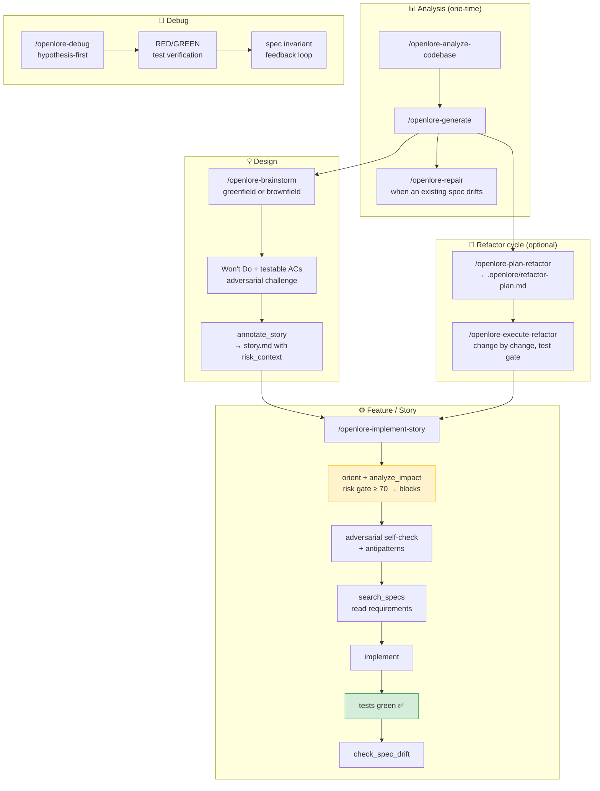

# Mistral Vibe assets for openlore

Mistral Vibe implementation of the [openlore agentic workflow pattern](../../docs/agentic-workflows/README.md).

## Contents

| Path | Purpose |
|---|---|
| [`../../skills/openlore-analyze-codebase/`](../../skills/openlore-analyze-codebase/) | Full static analysis — architecture, call graph, refactor issues, duplicates |
| [`../../skills/openlore-generate/`](../../skills/openlore-generate/) | Shared skill: author new OpenSpec specs from bounded, deterministic MCP generation evidence |
| [`../../skills/openlore-repair/`](../../skills/openlore-repair/) | Shared skill: reconcile existing OpenSpec specs from scoped MCP repair observations |
| [`../../skills/openlore-brainstorm/`](../../skills/openlore-brainstorm/) | Design a feature: greenfield (Domain Sketch) or brownfield (Constrained Option Tree) → annotated story |
| [`../../skills/openlore-plan-refactor/`](../../skills/openlore-plan-refactor/) | Identify highest-priority refactor target and write a plan |
| [`../../skills/openlore-execute-refactor/`](../../skills/openlore-execute-refactor/) | Apply a refactor plan produced by openlore-plan-refactor |
| [`../../skills/openlore-implement-story/`](../../skills/openlore-implement-story/) | Implement a story with structural pre-flight check, test gate, and drift verification |
| [`../../skills/openlore-debug/`](../../skills/openlore-debug/) | Debug a bug: hypothesis-first, RED/GREEN test verification, spec invariant feedback loop |
| [`../../skills/openlore-review-changes/`](../../skills/openlore-review-changes/) | Review changed functions by structural risk and produce a merge recommendation |
| [`../../skills/openlore-write-tests/`](../../skills/openlore-write-tests/) | Write tests from implementation and spec evidence |
| `antipatterns-template.md` | Starter template for `.claude/antipatterns.md` — copy to your project root |

## Workflow



## Usage

Copy the skills into your Mistral Vibe project skills directory and invoke them with their slash commands:

```
/openlore-analyze-codebase
/openlore-generate
/openlore-repair
/openlore-brainstorm
/openlore-plan-refactor
/openlore-execute-refactor
/openlore-implement-story
/openlore-debug
/openlore-review-changes
/openlore-write-tests
```

The Generate and Repair skills delegate evidence composition to OpenLore's MCP composites,
then use the host agent for semantic interpretation and native file editing. They do not
repeat the legacy prompt-driven codebase survey. Implementation-oriented skills follow the
generic pre-flight pattern:
- `orient` + `analyze_impact` before any code change
- adversarial self-check + antipatterns read before first edit
- test gate before `check_spec_drift`
- `check_spec_drift` after tests are green

## Antipatterns

Copy `antipatterns-template.md` to `.claude/antipatterns.md` in your project:

```bash
cp examples/mistral-vibe/antipatterns-template.md .claude/antipatterns.md
```

The antipatterns list is read by `openlore-brainstorm` (Step 1) and `openlore-implement-story` (Step 4b),
and written by `openlore-debug` (Step 9d) when a bug reveals a cross-cutting failure pattern.

## OpenSpec spec baseline

`search_specs` and `check_spec_drift` require specs to exist. Run `/openlore-generate`
once before using `/openlore-implement-story` for the first time — this creates the
baseline that makes spec alignment meaningful. Use `/openlore-repair` when an existing
domain spec needs additions, corrections, stale-reference reconciliation, or orphan review.

| State | What to do |
|---|---|
| No specs yet | `/openlore-analyze-codebase` then `/openlore-generate` |
| Specs exist and still match code | All skills work as expected |
| Existing spec is incomplete or stale | `/openlore-repair` for that domain |

`/openlore-implement-story` detects missing specs automatically and tells you what to do.
