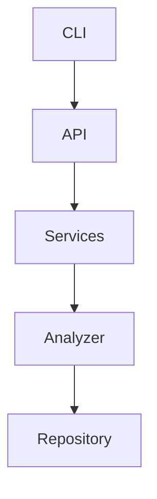

# Architecture Specification

> Generated by openlore v1.0.0 on 2026-04-05 10:50

## Purpose

This document describes the architectural patterns and structure of the system.

## Architecture Style

Layered architecture: CLI interface → API layer → service layer → repository pattern over various
data sources. This pattern is chosen for its clear separation of concerns, ease of maintenance, and
scalability.
## Requirements
### Requirement: LayeredArchitecture

The system SHALL maintain separation between:
- CLI (Command-line interface for user interaction and command processing)
- API (API endpoints and command handlers)
- Services (Business logic and orchestration)
- Analyzer (Code analysis and data extraction)
- Repository (Data persistence and retrieval)

#### Scenario: LayerSeparation
- **GIVEN** a request from the presentation layer
- **WHEN** business logic is needed
- **THEN** the presentation layer delegates to the business layer
- **AND** direct database access from presentation is prohibited

### Requirement: SecurityModel

The system SHALL implement security via: API key-based authentication for LLM providers; no user authentication for CLI tool

#### Scenario: AuthenticatedAccess
- **GIVEN** an unauthenticated request
- **WHEN** accessing protected resources
- **THEN** access is denied

### Requirement: DurableAtomicStorePersistence

The persisted memory and decision stores (`.openlore/memory/notes.json`,
`.openlore/decisions/pending.json`) SHALL be written atomically: a write goes to a
uniquely-named temporary file, is `fsync`'d, and is moved into place with an atomic rename,
after which the containing directory is `fsync`'d (best-effort) so the rename itself is
durable. A crash or interruption mid-write leaves the previously committed store intact and
never a partially written (torn) file. Each store SHALL carry a monotonic `sequence` field
(defaults to `0` for legacy stores) that orders writes and lets external readers detect
change. The read-modify-write SHALL be performed entirely inside a single per-store advisory
lock so that the lock — not an optimistic sequence guard — is the serialization point:
`mutate` always runs against the freshest on-disk store and a competing write cannot
interleave. The advisory lock SHALL carry an ownership token and be released only by the
writer that still owns it (so a hold stolen as stale is never freed out from under its new
owner); a crashed holder's lock SHALL become stealable well before a waiter gives up, and a
wait that times out SHALL fail loud rather than write unlocked. ALL writers of a given store
(record, approve/reject, consolidation, sync, and HTTP-API equivalents) SHALL go through this
single compare-and-swap path; a raw lock-free overwrite is prohibited because it would defeat
the serialization. Implemented in `src/core/decisions/atomic-store.ts`; guarded by
`atomic-store.test.ts`.

#### Scenario: A crash mid-write preserves the prior store
- **GIVEN** a store write interrupted between writing the temporary file and the rename
- **WHEN** the store is next loaded
- **THEN** the previously committed store is returned intact, with no torn or partial content

#### Scenario: Save uses compare-and-swap on sequence
- **GIVEN** a store loaded at sequence S
- **WHEN** a save is attempted but the on-disk sequence is no longer S
- **THEN** the save re-reads the current store, re-applies the pending change, and writes at
  the new sequence instead of overwriting

### Requirement: CorruptStoreQuarantineNotSilentEmpty

When a persisted store fails validation on load, the system SHALL move the unreadable file
aside to a quarantine path (`*.corrupt-<n>`) and emit a recoverable signal. The system SHALL
NOT silently substitute an empty store for a corrupt one, because silently losing persisted
memory presents absence as current fact and violates the authoritative-recall invariant. The
quarantine suffix SHALL be derived from on-disk state (the next free index), not wall-clock
time, to keep recovery reproducible. The claim on a quarantine path SHALL be atomic (it fails
if the path already exists), so two concurrent loaders can never overwrite each other's
quarantine file and lose preserved bytes.

#### Scenario: A malformed store is quarantined, not silently emptied
- **GIVEN** a store file that fails schema or JSON validation
- **WHEN** the store is loaded
- **THEN** the file is moved to `*.corrupt-<n>` and a recoverable signal is emitted, rather
  than an empty store being returned silently

### Requirement: ReadPathsNeverDestroyTheIndex

Opening the persisted graph store on a read path SHALL never mutate or destroy it. A schema-version
mismatch encountered by a read SHALL yield a typed not-ready conclusion — disclosing that the index
was built by a different OpenLore version and naming the recovery command (`openlore analyze`) —
which consuming tools SHALL surface to the user rather than serving an empty graph. Destructive
schema migration (drop-and-rebuild) SHALL be permitted only on analyze/write paths that repopulate
the store in the same operation. A store reset or version mismatch SHALL be surfaced proactively
(doctor, and a one-line notice on the next tool call), not merely recorded in an internal flag.

#### Scenario: Upgrade followed by a read command preserves the index

- **GIVEN** an index built under a previous SCHEMA_VERSION
- **WHEN** the user runs a read command (orient, search, any MCP query) after upgrading OpenLore
- **THEN** the on-disk store is not modified
- **AND** the command returns the not-ready conclusion naming `openlore analyze`, never an empty
  result presented as current fact

#### Scenario: Analyze still rebuilds on schema bump

- **GIVEN** the same version-mismatched store
- **WHEN** `openlore analyze` runs
- **THEN** the store is dropped, rebuilt at the current schema, and repopulated in that operation

#### Scenario: The reset is disclosed before the user has to ask

- **GIVEN** a store in the not-ready (version-mismatch or quarantined) state
- **WHEN** the user runs `openlore doctor` or any MCP tool
- **THEN** doctor reports the state with the recovery command, and the tool response carries a
  one-line notice of it

### Requirement: CorruptGraphStoreQuarantineParity

A graph-store database that fails to open (corrupt, truncated, or otherwise unreadable) SHALL be
handled with the same discipline `CorruptStoreQuarantineNotSilentEmpty` mandates for the decision
store: the unreadable file (with its WAL/SHM siblings) is moved aside to a quarantine path
(`*.corrupt-<n>`, suffix derived from the next free on-disk index, claimed atomically so concurrent
loaders cannot overwrite each other's quarantine) and a recoverable signal is emitted. The caller
SHALL receive the same honest not-ready conclusion as a schema mismatch — never an uncaught crash,
and never a silently recreated empty store presented as a healthy index. A transient lock (the DB is
readable but held by a writer) is NOT corruption and SHALL be surfaced for retry, never quarantined.

#### Scenario: A corrupt database is quarantined, not crashed on

- **GIVEN** a truncated or corrupt `call-graph.db`
- **WHEN** any command opens the graph store
- **THEN** the file is moved to the next free `*.corrupt-<n>` path and a recoverable signal is
  emitted
- **AND** the command returns the not-ready conclusion instead of throwing

#### Scenario: Concurrent loaders cannot lose preserved bytes

- **GIVEN** two processes opening the same corrupt store concurrently
- **WHEN** both attempt quarantine
- **THEN** exactly one atomic claim on the quarantine path succeeds and the corrupt bytes are
  preserved once; the other process observes the existing quarantine and returns not-ready

#### Scenario: No silent empty substitute

- **GIVEN** a quarantined graph store
- **WHEN** a read command runs before the next analyze
- **THEN** the result is the disclosed not-ready conclusion, never an empty graph served as if the
  codebase had no functions

### Requirement: ArtifactWritesAreAtomic

Every persisted analysis artifact (the JSON/Markdown/Mermaid set under the analysis output
directory — `llm-context.json`, `repo-structure.json`, `SUMMARY.md`, `dependencies.mermaid`, the
inventory/style/parse-health/duplicates/refactor artifacts, and `dependency-graph.json`) SHALL be
written via a single shared atomic-write discipline: the payload goes to a uniquely-named temporary
file in the same directory, is `fsync`'d, and is moved into place with an atomic rename (the same
`atomicWriteFile` primitive the durable stores use, `src/core/decisions/atomic-store.ts`). At no
observable moment SHALL an artifact exist on disk truncated or partially written — a crash or kill
mid-write leaves either the previous complete artifact or the new complete one. The discipline SHALL
have ONE implementation adopted by ALL writers — the analyze artifact generator
(`src/core/analyzer/artifact-generator.ts`) and the watcher's persist path
(`src/core/services/mcp-watcher.ts`) alike — replacing every bare `writeFile` and every per-site
inline `tmp + rename`. Guarded by `artifact-write-atomicity.test.ts` (writer adoption) and
`atomic-store.test.ts` (the primitive's durability).

#### Scenario: A crash mid-write cannot tear the artifact
- **GIVEN** a writer persisting `llm-context.json` is killed partway through
- **WHEN** a reader (MCP cache load, CLI command) next opens the artifact
- **THEN** it parses a complete artifact — the previous or the new version — and never falls back
  to "re-run analyze" because of a truncated file

#### Scenario: One atomic-write implementation, all writers
- **GIVEN** the analyze artifact generator and the watcher both persist artifacts
- **WHEN** either writes any artifact in the set
- **THEN** the write goes through the shared same-directory temp + rename helper, not a bare
  `writeFile` and not a per-site inline rename

### Requirement: ConcurrentArtifactWritersSerialize

Concurrent writers of the analysis artifact set (a running watcher's read-patch-write and a full
`analyze` — including the watcher's own self-heal `analyze --force` spawn) SHALL serialize their
artifact-write critical sections behind a cross-process advisory lock reusing the decision store's
established lock shape (exclusive-create lock file, stale-lock steal, bounded wait, best-effort
proceed on timeout) with its existing constants — no second locking mechanism and no new tuning
values. The lock SHALL be keyed on the analysis output directory (its file living inside that
directory) so two writers of the same directory contend and writers of different directories do
not. Each writer's whole artifact-mutation section — the analyze save-set, and the watcher's change
and deletion lanes — SHALL be one locked critical section, so overlap resolves to one writer's
complete, self-consistent output followed by the other's, never an interleaving of the two. The
per-artifact persist helper SHALL remain lock-free (it runs inside a lane that already holds the
lock), so a lane never re-acquires the lock it holds. Implemented in `src/core/decisions/lock.ts`
(`acquireAnalysisLock`/`withAnalysisLock`); guarded by `lock.test.ts`.

#### Scenario: Watcher self-heal does not race the watcher
- **GIVEN** a watcher that has spawned a detached `analyze --force` while continuing to serve and
  persist
- **WHEN** both processes reach their artifact-write sections
- **THEN** the lock serializes them; the final on-disk artifact set is one writer's complete,
  self-consistent output — never an interleaving of the two

#### Scenario: A crashed lock holder does not wedge analysis
- **GIVEN** a writer that died holding the analysis lock
- **WHEN** the next writer arrives after the stale threshold
- **THEN** it steals the lock and proceeds, matching the decision store's documented recovery
  behavior

#### Scenario: The analysis lock is independent of the decisions lock
- **GIVEN** a consolidation holding the decisions lock
- **WHEN** an analyze or watcher persist takes the analysis lock
- **THEN** it does not wait on the decisions lock — the two are distinct files and never contend

### Requirement: AdditiveBitemporalMemorySchema

The memory record schema SHALL be extended additively with optional bitemporal fields:
`validFromCommit` (commit SHA at record time), `invalidatedAt`, and `invalidatedByCommit`, plus an
optional `type` from a fixed closed set (defaulting to `note`) and an optional `supersedes` provenance
field. All SHALL be optional so that memory stores written before this change load without migration
and behave as always-valid, never-invalidated, and typed as `note`. The valid-from marker SHALL be
derived deterministically from git `HEAD`, never from an LLM or a clock-only value, so recall history
is reproducible for a fixed repository state. The `type` SHALL be a caller-supplied label, never
inferred.

#### Scenario: Legacy memory loads without migration
- **GIVEN** a memory store written before bitemporal fields existed
- **WHEN** the store is loaded
- **THEN** every memory loads successfully and is treated as authoritative (never invalidated), with
  no migration step required

#### Scenario: Valid-from is reproducible
- **GIVEN** the same repository at the same commit
- **WHEN** a memory is recorded twice in that state
- **THEN** both records carry the same `validFromCommit`

> Decision recorded: 48771c59
> Date: 2026-06-18

### Requirement: DigestFiguresUseOnePopulationPerLabel

Every figure in the generated codebase digest SHALL be computed over the population its
label names, and adjacent figures presented as a coherent overview SHALL share one
population definition: a count labeled "internal" SHALL exclude exactly what the adjacent
internal counts exclude (test and external nodes/edges), or the label SHALL name the true
population. List-shaped digest sections (e.g. spec domains) SHALL be emitted in a sorted,
platform-independent order, never raw directory-enumeration order.

#### Scenario: The edge count matches its label

- **GIVEN** a call graph containing production, test-caller, and external-callee edges
- **WHEN** the digest renders the "internal call edges" figure next to the
  production-function count
- **THEN** either the edge figure counts only edges between non-test, non-external nodes,
  or its label names the wider population it actually counts — the two adjacent figures
  are never mixed populations under one qualifier

#### Scenario: Spec domains render platform-independently

- **GIVEN** the same spec directory enumerated on two platforms with different readdir
  ordering
- **WHEN** the digest is generated on each
- **THEN** the spec-domain list is identical (sorted), keeping the digest bytes stable
  across platforms

#### Scenario: A regenerated digest explains a moved headline number

- **GIVEN** a digest regenerated after the edge-population fix
- **WHEN** the "internal call edges" figure changes
- **THEN** the change is attributable to the corrected population, with both the old and
  new definitions stated in the change that moved it

### Requirement: SpecDrivenDevelopmentDelegatedToOpenSpec

OpenLore is a distinct product from OpenSpec and SHALL NOT reimplement OpenSpec's spec-driven-
development lifecycle. OpenSpec (`@fission-ai/openspec`) is OpenLore's spec-driven-development
framework: it owns authoring change proposals and the change→archive lifecycle, folding a change's
spec deltas into the main corpus (`openspec archive`), and listing / validating / showing changes
and specs (`openspec list`, `openspec validate`, `openspec show`, `openspec status`).

OpenLore's product surface SHALL be confined to deterministic, locally-computed structural memory
over code: the call graph, reachability and impact, symbol-anchored memory and decisions, code↔spec
drift detection, and generating OpenSpec-format specs from code. OpenLore therefore:

- SHALL delegate change-lifecycle operations to the OpenSpec CLI and SHALL NOT ship an
  `openlore change`, `openlore archive`, or `openlore validate-changes` command, nor an MCP tool,
  that folds spec deltas or manages the change→archive lifecycle.
- MAY read the OpenSpec corpus and generate OpenSpec-format specs (the integration surface), and
  MAY govern its own decision records within that corpus (see
  [openspec: DecisionSyncWritesOneOwningDomain](../openspec/spec.md)).

Every proposed capability SHALL be justified against this boundary: if a capability's value is
change-lifecycle management, it belongs to OpenSpec, not OpenLore.

#### Scenario: A lifecycle capability is delegated, not rebuilt

- **GIVEN** a need to fold a shipped change's spec deltas into the main corpus and archive it
- **WHEN** the work is scoped
- **THEN** it is performed with `openspec archive` and OpenLore adds no equivalent command, fold
  engine, or MCP tool

#### Scenario: A proposal that rebuilds OpenSpec is rejected as out of scope

- **GIVEN** a proposal to add an `openlore change list` / `openlore change archive` surface
- **WHEN** it is reviewed against this requirement
- **THEN** it is rescoped to consume the OpenSpec CLI, retaining only genuinely OpenLore-native
  structural or decision-governance work

### Requirement: UnifiedStructuralSubstrate

OpenLore SHALL be one structural substrate with two faces, not two products. Its navigation
capabilities (reads that return conclusions about code structure) and its governance capabilities
(writes and checks that anchor facts to code and gate changes against it) SHALL be grounded in a single
shared spine:

1. **One graph.** A single deterministically-extracted structural graph — the call graph plus its IaC,
   cross-service HTTP, and type-hierarchy projections — SHALL be the sole source of structural truth.
   Every navigation conclusion and every governance check SHALL be computed from this one graph, not
   from a parallel graph maintained alongside it.
2. **One anchored-fact store.** Durable facts an agent records — code-anchored memories and recorded
   architectural decisions — SHALL share one anchoring model: each is bound to a symbol or file,
   self-invalidates when its anchor changes, and is carried across a rename or move by the same
   symbol-identity continuity mechanism. A new durable-fact type SHALL reuse this anchoring model
   rather than introduce a parallel store.
3. **One freshness lease.** A single deterministic freshness/decay mechanism SHALL govern the staleness
   of every anchored conclusion — a memory's freshness verdict, a decision citation's currency, and a
   change certificate's decay — anchored to the same touched symbols and computed by the same rule. A
   new capability that ages out SHALL decay via this lease rather than define its own staleness rule.

A new capability SHALL attach to this spine — reading the one graph, anchoring to the one fact store,
and decaying via the one lease — rather than constituting a separate product surface or a parallel
mechanism. This requirement does not constrain how tools are grouped or surfaced (see `mcp-quality`);
it constrains the underlying model so that navigation and governance remain faces of one substrate.

#### Scenario: A governance check reads the same graph as navigation

- **GIVEN** the indexed structural graph that navigation tools traverse
- **WHEN** a governance capability (claim verification, blast radius, a change certificate, the commit
  gate) computes its result
- **THEN** it derives that result from the same single graph, not from a separately-maintained one
- **AND** a change to the graph is reflected identically in both the navigation conclusion and the
  governance check

#### Scenario: A new durable-fact type reuses the shared spine

- **GIVEN** a proposed capability that records a new kind of durable, code-anchored fact
- **WHEN** it is designed
- **THEN** it anchors the fact to a symbol or file using the existing anchoring model, self-invalidates
  when the anchor changes, and ages via the existing freshness lease
- **AND** it does not introduce a parallel fact store or a second staleness rule

#### Scenario: The substrate is presented as one product

- **GIVEN** the navigation face and the governance face of the substrate
- **WHEN** the capabilities are documented or surfaced to an agent
- **THEN** they are presented as two faces of one substrate over a shared spine, not as two independent
  products

### Requirement: EveryLongLivedSurfaceHasOneTeardownPath

Each surface that acquires process-lifetime resources — a file watcher, a graph-store handle, an
interval, a listening socket — SHALL expose exactly one teardown path, and every way that surface can
end SHALL route through it. A surface SHALL NOT acquire a resource whose handle keeps the process
alive beyond its own transport unless it also owns the signal that releases it. Where a teardown may
be missed, the handle SHALL be `unref`'d so the failure mode is an early exit rather than a process
that never exits.

This generalizes the lesson each surface has learned separately: `serve` grew an idle-timeout reaper
because orphaned daemons accumulated in RAM, and the stdio server exhibits the same accumulation
through a different door (stdin EOF). The requirement is on the shape, so a future surface inherits
it instead of rediscovering it.

#### Scenario: A new local surface cannot leak its watcher

- **GIVEN** a surface that starts a file watcher during request handling
- **WHEN** its transport closes
- **THEN** the watcher is stopped by the surface's single teardown path and the process exits

#### Scenario: A missed teardown degrades safely

- **GIVEN** a timer or watcher handle acquired by a surface whose transport has closed
- **WHEN** teardown does not run for that handle
- **THEN** the handle does not by itself keep the process alive, so the observable failure is an
  early exit rather than a hang

### Requirement: TheTrustBoundaryForServedKnowledgeIsHumanReview

The system SHALL state that served knowledge becomes authoritative because a human reviewed and
accepted it, not because the serving surface is read-only or deterministic. Read-only serving
protects the store from mutation; determinism returns the same bytes. Neither property SHALL be
presented as protecting a consuming agent from malicious content.

The published security posture SHALL state what the read-only guarantee covers and what it does
not, including that content which has not passed human review is outside that guarantee.

The serving path SHALL NOT add a sanitizer, trustworthiness score, or model-computed belief verdict.
Introducing one SHALL require a superseding architectural decision.

#### Scenario: The published posture names the boundary

- **GIVEN** a user reading the security posture
- **WHEN** they inspect the read-only serving guarantee
- **THEN** it states that the guarantee protects the store
- **AND** it identifies human review as the authority boundary for served content

#### Scenario: A sanitizer requires a superseding decision

- **GIVEN** a proposal to filter, rewrite, or score served content in the serving path
- **WHEN** it is reviewed
- **THEN** it is refused unless it supersedes this requirement through a recorded decision

#### Scenario: Determinism is not overclaimed

- **GIVEN** documentation describing deterministic serving
- **WHEN** it states what determinism guarantees
- **THEN** it does not claim that repeatable bytes are benign or safe for an agent to obey

### Requirement: FullRebuildIsAtomicForConcurrentReaders

A full rebuild of the edge store SHALL be atomic with respect to concurrent readers: a
process reading the store while a rebuild is in progress SHALL observe either the complete
previous graph or the complete new graph, never a partial state (empty nodes, or nodes
without their edges). A rebuild interrupted by a crash SHALL leave the previous complete
graph intact, not a half-written store.

#### Scenario: A reader during rebuild never sees a partial graph

- **GIVEN** the MCP server answering `analyze_impact` while `openlore analyze` rebuilds the
  store in another process
- **WHEN** the read lands between the store clear and the final insert
- **THEN** it reads the complete prior graph (or the complete new one), never zero nodes or
  edge-less nodes, so it does not report a real symbol as dead or callerless

### Requirement: EdgeStoreRebuildIsIdempotentUnderConcurrency

A full rebuild SHALL be idempotent under concurrency: two rebuilds running at once, or a
retried rebuild, SHALL NOT double the edge set. This SHALL be enforced structurally (edge
uniqueness or a single-writer rebuild lock), not by convention.

#### Scenario: Cold-start bootstrap and a manual analyze do not double the graph

- **GIVEN** the cold-start bootstrap building the index while the user runs `openlore analyze`
- **WHEN** both rebuild the store
- **THEN** the resulting graph has single-count edges and correct fan-in, not doubled caller
  lists

### Requirement: WatcherLockContentionNeverSilentlyDropsWork

When a watcher write loses the store's write lock past the busy timeout, the watcher SHALL
retry with bounded backoff and, on continued contention, buffer the stale-mark until the
store is writable and disclose the deferred work — it SHALL NOT drop the batch with only a
stderr line, which would leave the graph silently stale for those files.

#### Scenario: A long rebuild lock does not strand stale files

- **GIVEN** a full-rebuild write holding the WAL lock longer than the busy timeout
- **WHEN** a watcher batch write contends and times out
- **THEN** the watcher retries or buffers the stale-mark and discloses it, so the affected
  files are eventually re-analyzed rather than left silently stale

## System Diagram

## Layer Structure

### CLI

**Purpose**: Command-line interface for user interaction and command processing
**Location**: `src/cli/commands/mcp.ts, src/cli/commands/view.ts, src/cli/commands/openlore.ts`

### API

**Purpose**: API endpoints and command handlers
**Location**: `src/api/run.ts, src/api/generate.ts, src/api/init.ts, src/api/drift.ts`

### Services

**Purpose**: Business logic and orchestration
**Location**: `src/core/services/config-manager.ts, src/core/services/llm-service.ts, src/core/services/chat-tools.ts, src/core/services/mcp-handlers/utils.ts`

### Analyzer

**Purpose**: Code analysis and data extraction
**Location**: `src/core/analyzer/signature-extractor.ts, src/core/analyzer/call-graph.ts, src/core/analyzer/vector-index.ts`

### Repository

**Purpose**: Data persistence and retrieval
**Location**: `src/utils/command-helpers.ts, src/core/services/mcp-handlers/utils.ts`

## Data Flow

CLI command → API endpoint → service → analyzer → repository; results are returned to the user via
CLI output or API responses

## External Integrations

| System | Purpose |
|--------|---------|
| Git | External integration |
| OpenAI-compatible APIs (Gemini, Anthropic, OpenAI, etc.) | External integration |
| LanceDB for vector indexing | External integration |
| tree-sitter for code parsing | External integration |
